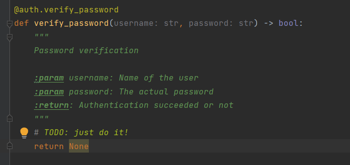

How to - Docu
=============
#. **installs**

    * python -m pip install sphinx
    * pip install sphinx-rtd-theme
    * python(3) -m pip install sphinx-toolbox --user

#. **initial setup**

    * sphinx-quickstart

#. **add extensions**

    * extensions = ['sphinx.ext.todo', 'sphinx.ext.viewcode', 'sphinx.ext.autodoc']

#. **set theme in source/conf.py**

    * html_theme = 'sphinx_rtd_theme'

#. **add syspath in source/conf.py (for autodocumentation)**

    * import os

    * import sys

    * sys.path.insert(0, os.path.abspath("../"))

#. **build**

    * sphinx-build -b html source build

#. documentation example:

